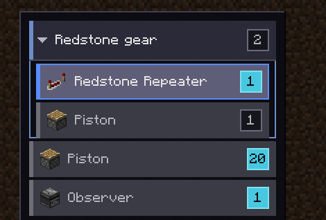
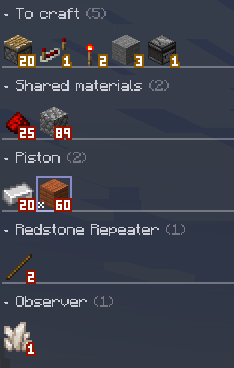
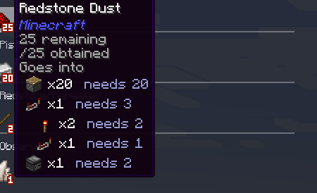
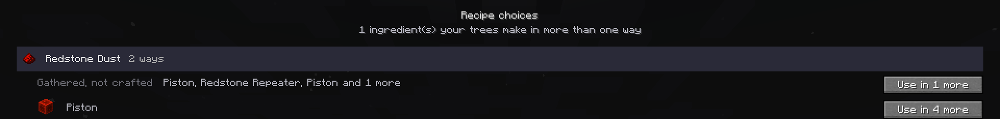
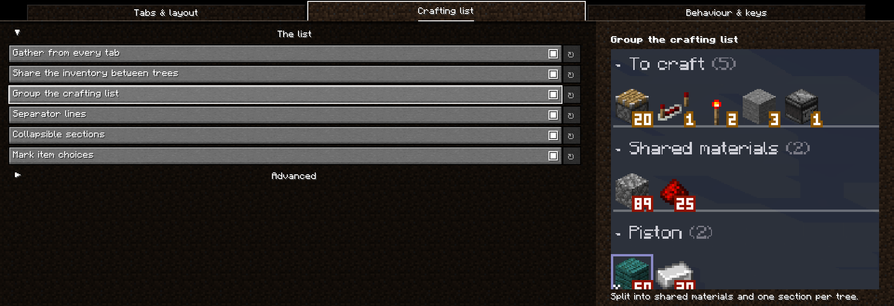

# EMI Tree Tabs

Track more than one EMI recipe tree at a time, and get a crafting list that spans all of them.

**Minecraft 1.20.1 · Forge and Fabric · requires [EMI](https://modrinth.com/mod/emi) 1.1+ · client-side only**

[Modrinth](https://modrinth.com/mod/ett-emi-tree-taps) · [CurseForge](https://www.curseforge.com/minecraft/mc-mods/ett-emi-tree-tabs) · [Releases](https://github.com/ROOCKY-dev/emi-tree-tabs/releases)

EMI keeps exactly one crafting tree in memory, so opening a second one silently throws away the
first. This mod keeps a list of them and swaps the right one into place when you change tab — EMI's
own tree screen does all the drawing and editing, so every tree behaves exactly as you expect.



---

## What it does

### Tabs, in one of two layouts

Every tree you open becomes a tab instead of replacing the last one. Hold **Shift** while opening to
invert that for one click.

The **floating sidebar** above is the default wherever the screen can host it: a panel down the left
with room for names, batch counts and phase headers at any GUI scale. On a screen too small it falls
back to a **horizontal strip** along the top, which shrinks tabs down a fixed floor and then scrolls
rather than letting the close button vanish. `tabOrientation` forces either one.

- **Live progress per tab** — grey (nothing gathered), amber (partly stocked), green (you have
  everything), checked against your inventory on a timer
- **Fork a tree** with `Ctrl+D` — same goal, independent resolutions, so you can compare two routes
  to the same item side by side
- **Rename** so "Reinforced alloy for the smelter" isn't just another iron ingot icon
- **Per-tab viewport** — each tab keeps its own pan, zoom and batch count
- **Per-tab view/craft mode** — only trees in crafting mode feed the crafting list, so you can keep
  a dozen open for reference and still see only what you're actually building
- **Tabs survive restarts** — stored as their goal recipe plus the resolutions you picked

### Phases

A big build has stages: you need a whole set of items *before* a later set of machinery, and a
crafting list that totals all of it at once is telling you to gather things you cannot use yet.

So trees can be grouped into a **phase** — a named, coloured, foldable group. Make one with the
sidebar's phase button or `Ctrl+G`, name it as it is created, then drag other tabs onto its header.

The point is **parking**. Right-click a phase header and its trees stop feeding the crafting list
while staying exactly where they are, with their own crafting flags untouched, so unparking restores
what you had. Shift+right-click parks everything *except* that phase — the whole workflow in one
gesture.

### A crafting list across every tree

With more than one tree in crafting mode, EMI's crafting list draws from all of them, with duplicate
recipes and materials merged into single entries.

Trees are costed against a **shrinking pool** rather than each getting your whole inventory. Two
trees each needing 10 iron with 10 in the chest correctly report 10 still needed, instead of both
declaring themselves satisfied. Reorder tabs to change which tree gets first claim.

The mod adds a **Crafting** page type to EMI's own sidebar picker, alongside Index, Craftables and
Favourites. Add it as a *page* or a *subpanel* on any sidebar and the list lives there, split into
**To craft**, **Shared materials** (wanted by two or more trees) and one section per tree, with
titles you can click to fold.

An entry that would accept *any of several* items — a tag — is framed, so it cannot be mistaken for
the plain item a different tree happens to want.



### What a shared material is actually for

The list can tell you that you need 184 copper. It cannot tell you how much of that is for plates
and how much for pipes, so deciding whether to spend copper now means doing the arithmetic by hand.

Hover a material and it says which trees want it and how much each takes. Hold **Shift** and it
breaks that down again by sub-craft, so you can see that two of the redstone goes into torches
rather than into the repeater directly. Each line shows the item itself, how many of it are needed
in full, and how much of the material that takes.



### Making the trees agree

Progression unlocks a cheaper way to make some intermediate part. You change it on the tree in front
of you, and the other eight machines quietly carry on using the expensive one.

**Recipe choices** finds them. It is nothing until you ask for it: a button appears in the sidebar
only while your open trees actually disagree about how to make something, and `Ctrl+R` opens it from
anywhere. The screen lists each contested ingredient, each way of making it, the inputs that tell
those ways apart, and which trees use each — and every button says how many trees it would change
before you press it. Only that one sub-craft changes; nothing else about those trees is touched.



### Typing a quantity

Wanting a specific number is usually arithmetic you did in your head — *32 machines, 4 each, 2 per
that*. `Ctrl+click` a tab's batch marker and type `32 * 4 * 2` instead of leaving for a calculator.
Four operators, brackets, `x` as well as `*`, the result shown live as you type, and every refusal
carrying a readable reason.

---

## Controls

All on EMI's recipe tree screen.

| Action | Binding |
| --- | --- |
| Switch tab | Left click, or `Ctrl+Tab` / `Ctrl+Shift+Tab` |
| Jump to tab 1–8, or last | `Ctrl+1` … `Ctrl+8`, `Ctrl+9` |
| Reorder, or move into a phase | Drag a tab |
| Rename a tab or phase | `F2`, or right click a tab on the strip |
| View ⇄ craft mode | `Ctrl+click` a tab on the strip, or click its marker in the sidebar |
| Set how many to make | `Ctrl+click` the batch marker |
| Close | Middle click, the `×`, or `Ctrl+W` |
| Reopen closed tab | `Ctrl+Shift+T` |
| Fork the current tree | `Ctrl+D`, or the `+` button on the strip |
| Craft every tab at once | The craft-all button, or `Ctrl+A` |
| Open a tree already crafting | `Ctrl+click` a recipe's tree button |
| **New phase** | The phase button, or `Ctrl+G` |
| **Park a phase** | Right click its header · Shift+right click parks all the others |
| **Fold a phase** | Left click its header |
| **Drop a phase** | Middle click its header — its trees stay open |
| **Recipe choices** | The fork button when it appears, or `Ctrl+R` |
| Scroll | Mouse wheel over the bar or panel |

---

## Setting up the crafting panel

1. In **EMI's** settings, add a page or subpanel to a sidebar
2. Choose **Crafting** from the picker

That's it. Once a Crafting panel exists the favourites sidebar stops carrying the crafting list, so
it isn't shown twice. **Sections, separators and the tag frames only appear on this page** — without
it you get the aggregated list flat, in Favourites.

If the page type is missing from the picker, the mod could not register it — check `latest.log` for
a warning from `emitreetabs`, and it will fall back to sharing the favourites panel.

---

## Config

In game: the **settings button in the tab sidebar**, or **Mods → EMI Tree Tabs → Config** on Forge.
Either needs [YACL](https://modrinth.com/mod/yacl). That is a *soft* dependency — without it the mod
works identically and you edit `config/emitreetabs.json` by hand. Edits to that file are picked up
within a couple of seconds without restarting.

Three tabs — *Tabs & layout*, *Crafting list*, *Behaviour & keys*. The layout options carry a live
tab bar that redraws as you change them, the crafting-list options carry a picture of what they do,
every slider says what its value means rather than showing a bare number, and anything that touches
how tabs are stored is collapsed into *Advanced*.



| Key | Default | Meaning |
| --- | --- | --- |
| `enabled` | `true` | Off means no tab bar and stock EMI behaviour |
| `tabOrientation` | `auto` | `auto`, `horizontal` or `vertical`. Auto takes the sidebar whenever the screen can host it |
| `openInNewTab` | `true` | New trees open as a new tab; Shift inverts per click |
| `persistTabs` | `true` | Save open tabs between sessions |
| `showProgress` | `true` | Colour tabs by inventory progress |
| `progressIntervalMs` | `500` | How often to recheck progress |
| `barAtBottom` | `false` | Strip along the bottom; also puts the sidebar on the right |
| `maxTabs` | `32` | Each tab holds a whole material graph, so this is the main lever on memory |
| `closedTabHistory` | `16` | How many closed tabs `Ctrl+Shift+T` can restore; `0` disables |
| `keyboardShortcuts` | `true` | Master switch for the shortcuts above |
| `aggregateCraftingFavorites` | `true` | Crafting list draws from every tree in crafting mode |
| `sharedCraftingInventory` | `true` | Trees claim materials in tab order rather than each assuming the whole inventory |
| `groupCraftingList` | `true` | Split the crafting list into sections |
| `showGroupSeparators` | `true` | Draw a rule between sections |
| `collapsibleGroups` | `true` | Click a section title to fold it |
| `markChoiceEntries` | `true` | Frame an entry that accepts any of several items, so a tag is not mistaken for a plain item |
| `craftingInFavorites` | `true` | Allow the favourites sidebar to also carry the crafting list. Ignored once a Crafting page is placed |
| `craftingPanelSide` | `NONE` | Fallback: take over one side's Favourites panel |
| `useExternalStock` | `false` | Count materials another mod says you have elsewhere. Does nothing unless such a mod is installed |

---

## For mod authors

There is a small, versioned API in `dev.roocky.emitreetabs.api` for adding to the crafting list
without touching EMI's internals yourself. You can register a **stock source** (materials the player
has in chests, which then count towards the list), a **locate provider** (where to find something
they are short of), and a **listener** for the list changing.

It is designed to be used without a hard dependency — one entry method with a frozen signature that
returns `null` rather than a registry that would break halfway through. See [API.md](API.md).

---

## Known limitations

- **Section titles take a full row.** EMI's sidebar is a fixed 18px grid and hover detection maps
  mouse position back through that same arithmetic, so giving a title only its text height would
  mean overriding EMI's layout in several places at once and risking clicks landing on the wrong
  item. The separator lines are free — they're drawn in the gap — but text is not.
- **Sections align to rows, not pages.** EMI paginates sidebars, so a section can straddle a page
  break. Padding to page boundaries would waste a lot of slots in a narrow sidebar.
- **A merged tree can only hold one recipe per ingredient**, which is why there is no single
  combined tree view. Two tabs smelting iron differently could not both be honoured in one.
- **The strip shows phase membership but not phase grouping.** A tab carries its phase's colour, but
  the strip does not reorder tabs into runs the way the sidebar does — that needs non-uniform tab
  widths, which the hit tests and drag arithmetic currently assume away.

## Compatibility

Hooks EMI's internals rather than a public API, because EMI exposes none for crafting trees. Pinned
working combination: **EMI 1.1.24 · Forge 47 · MC 1.20.1**. An EMI update that renames the internals
listed in the source will break this, most likely as a startup error rather than a silent failure.
Tested alongside EMI++ (`emixx`) and in a 377-mod pack, where the mod measured below 0.03% of
render-thread CPU and 0.004% of allocation.

## Building

Needs a **JDK 17**.

```bash
./gradlew build
```

Jars land in `forge/build/libs/` and `fabric/build/libs/`. `./gradlew :forge:runClient` or
`:fabric:runClient` starts a dev client with EMI and YACL on the classpath.

## Roadmap and contributing

What is planned, and what is deliberately not, is in [ROADMAP.md](ROADMAP.md).

Pull requests are welcome — [CONTRIBUTING.md](CONTRIBUTING.md) covers the build and the couple of
things about this mod that are unusual enough to trip you up. The parts that can be tested without
launching the game — tab and sidebar geometry, drag resolution, the expression parser, the API
version gate — have 99 tests; everything that touches EMI has to be run in game.

## AI disclosure

The code in this mod was written by an AI assistant working from my direction. See
[AI-DISCLOSURE.md](AI-DISCLOSURE.md) for the full statement.

## Licence

[MIT](LICENSE).
